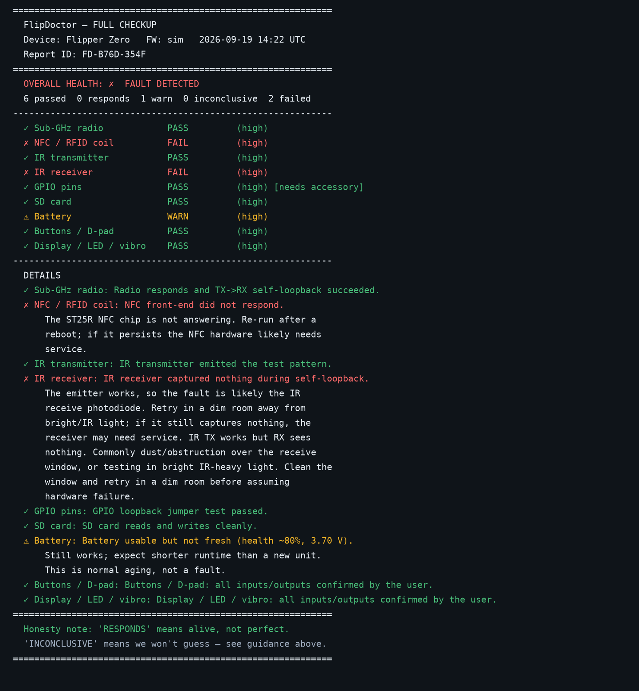
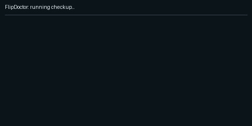
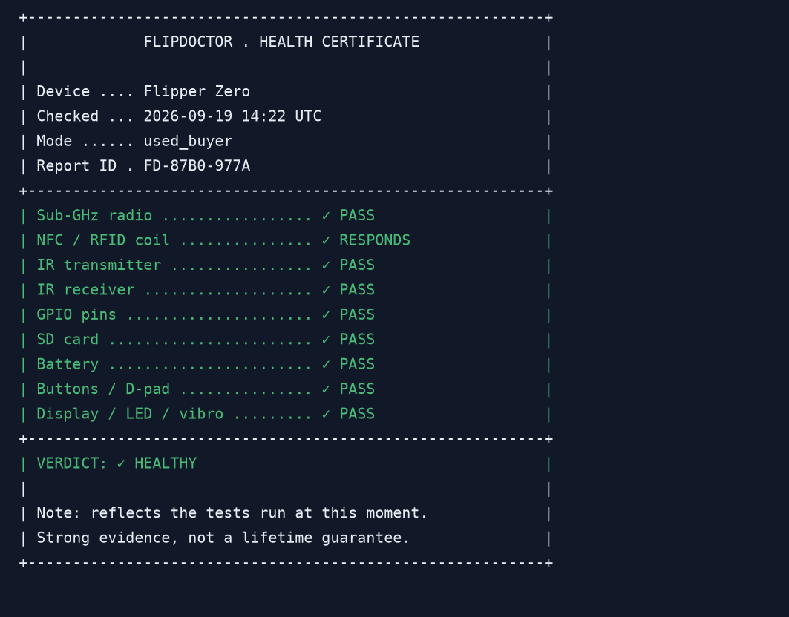
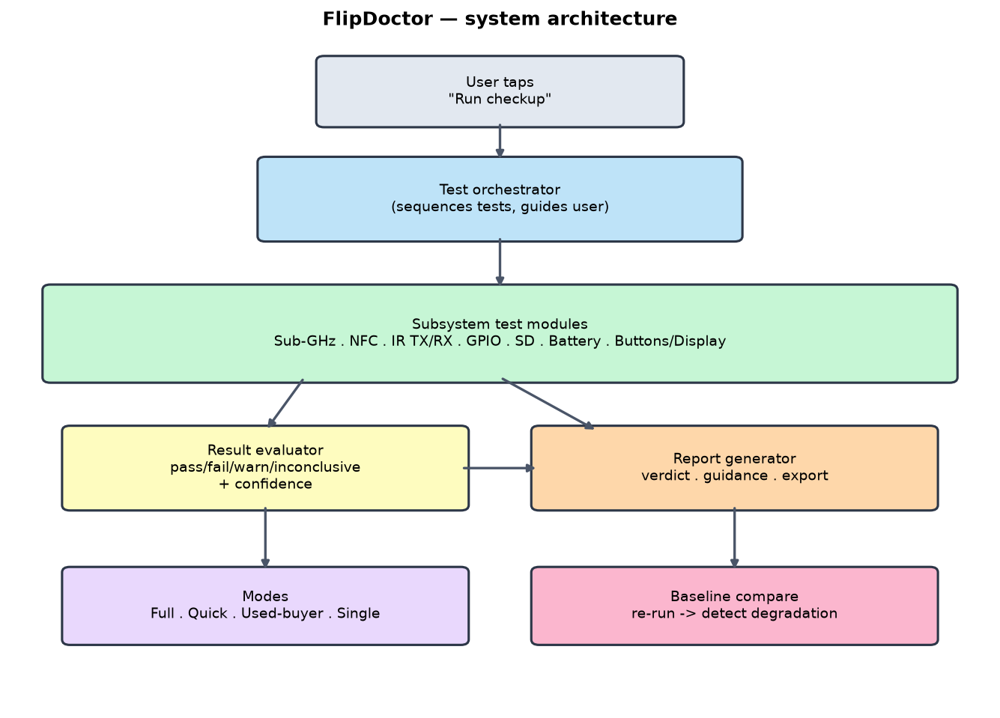
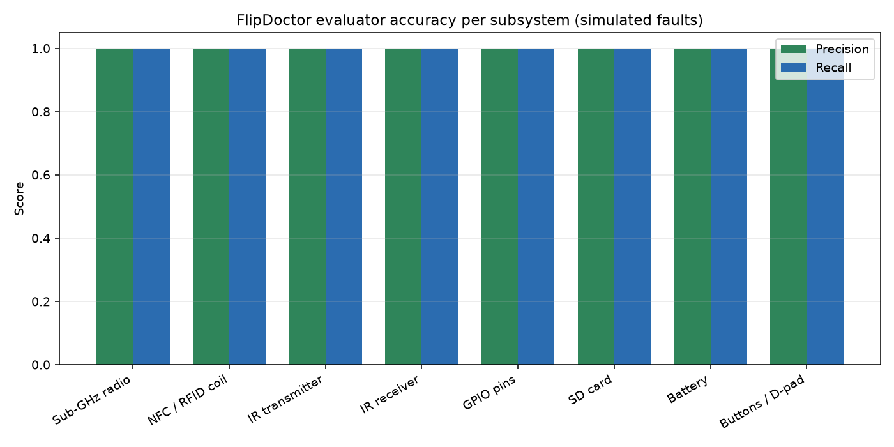
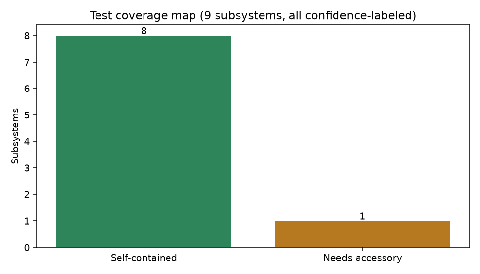

# 🩺 FlipDoctor for Flipper Zero

[](https://github.com/Krishita17/flipdoctor-flipperzero/actions/workflows/ci.yml)
[](LICENSE)

**A one-tap health & self-diagnostics app for your Flipper Zero.**
Run a full checkup — sub-GHz, NFC, IR, GPIO, SD, and battery — and get a plain-language pass / fail report. Perfect before buying used.

> **Sole contributor:** Krishita Sanjay Choksi. This project was designed, built, and is maintained entirely by Krishita Sanjay Choksi.

---

## The health report (hero)

One tap gives you a clean verdict, per-subsystem status, and honest confidence for every check:



*Above: a real report rendered by the tool (a device with a dead NFC coil, a failed IR receiver, and an aging battery). Generated by `figures/generate_figures.py` from the actual evaluator output — not hand-drawn. On a physical Flipper the same report renders on the 128×64 screen and exports to SD as text.*

### Watch a checkup run



*A full checkup revealing each subsystem verdict in turn (code-generated from real evaluator output; a screen capture from a physical device can replace it).*

---

## One-line pitch

A one-tap self-diagnostics app for the Flipper Zero that tests every subsystem — radio, NFC, IR, GPIO, SD, battery — and gives a plain-language health report, so owners (and used-device buyers) finally know if their hardware is actually OK.

## Why it exists

Every Flipper owner eventually asks: *"Is my hardware broken, or am I just doing it wrong?"* NFC won't read — dead coil or unsupported card? Sub-GHz capture failed — bad antenna or wrong frequency? IR won't control the TV — broken emitter or wrong code? There was never a way to check. FlipDoctor is the "run diagnostics" button the device never had.

And if you're **buying a used Flipper**, you finally have a way to verify it works before you pay.

---

## Honest positioning (prior art)

FlipDoctor did **not** invent hardware testing. The Flipper firmware already has some low-level self-checks, and single-feature apps exist that exercise individual subsystems. Full credit to that prior work — see [`docs/prior_art.md`](docs/prior_art.md).

**What FlipDoctor contributes is the packaging that didn't exist:**

1. A **unified, one-tap** diagnostic suite — every subsystem in one flow with a single verdict.
2. **Interpretable** results — not raw readings, but "IR RX: FAIL — here's what that means and what to try."
3. A dedicated **used-buyer verification mode**.
4. A **repeatable baseline** — save a report, re-run later, catch degradation over time.

---

## The honesty layer (why you can trust it)

A diagnostic that overclaims is worse than none. FlipDoctor is deliberately conservative:

- Every test reports one of **PASS / FAIL / WARN / INCONCLUSIVE**, each with a **confidence level**.
- Tests are labeled **self-contained** vs. **stronger-with-accessory** (reference card, jumper, known IR target).
- It never fakes certainty. "NFC field detected" means *the coil is driving a field* — not that every card type will read. The report says exactly this.
- When unsure, it prefers **"inconclusive — here's how to verify further"** over a false verdict. A wrong "your NFC is dead" could cost you a device or money.

Full accuracy/scope discussion in [`docs/threat_model.md`](docs/threat_model.md).

---

## Subsystem test table

| Subsystem | What's tested | Self-contained? | What a PASS means | What a FAIL means |
|---|---|---|---|---|
| **Sub-GHz radio** | Transceiver responds; TX→RX self-loopback where hardware allows | ✅ Self-contained | Radio path responds | Transceiver not responding — likely radio/antenna fault |
| **NFC / RFID coil** | Field/self-detection check | ✅ Self-contained (stronger with reference card) | Coil is driving a field | Coil not energizing — likely NFC front-end fault |
| **IR transmitter** | Emits a known pattern | ✅ Self-contained | Emitter fires | Emitter not driving — likely IR TX fault |
| **IR receiver** | Receives the emitted pattern back (self-loopback) | ✅ Self-contained (stronger with known target) | Receiver captured the pattern | No capture — likely IR RX photodiode fault |
| **GPIO pins** | Drive/read pins; optional guided loopback jumper | ⚠️ Stronger with jumper | Pins respond (or jumper confirms) | Pin not responding — possible GPIO fault |
| **SD card** | Read/write, corruption/health, capacity sanity | ✅ Self-contained | Card reads/writes cleanly | Read/write or corruption error — card or slot issue |
| **Battery** | Voltage, charge behavior, health estimate | ✅ Self-contained | Voltage & health nominal | Out-of-range voltage or degraded health |
| **Buttons / D-pad** | Interactive press check | ✅ Self-contained (interactive) | All inputs registered | A button didn't register |
| **Display / LED / vibro** | Interactive visual/haptic check | ✅ Self-contained (interactive) | User confirms all outputs | User reports a missing output |

Legend: ✅ runs entirely on-device · ⚠️ definitive result needs a cheap accessory.

---

## Used-buyer mode — the "health certificate"

Thinking of buying a used Flipper? Run **Used-Buyer Verify** and export a shareable certificate. Sellers can attach it to a listing; buyers can ask for it before paying.



*A shareable, structured snapshot of a device's health at test time. Every certificate carries a Report ID and the honest caveat: **strong evidence, not an absolute lifetime guarantee.** This is the traction multiplier — it gets passed around the used market.*

---

## Modes

- **Full checkup** — every subsystem, one tap (default).
- **Quick check** — the fast, self-contained subset.
- **Used-buyer verify** — purpose-built pre-purchase flow → exports the health certificate.
- **Single subsystem** — test just one thing.
- **Baseline compare** — save a report, re-run later, detect degradation over time.

---

## Architecture

```mermaid
flowchart TD
    U([User taps "Run checkup"]) --> ORCH[Test orchestrator<br/>sequences tests · guides user · collects results]
    ORCH --> TESTS[Subsystem test modules<br/>Sub-GHz · NFC · IR TX/RX · GPIO · SD · Battery · Buttons/Display]
    TESTS --> EVAL[Result evaluator<br/>pass / fail / warn / inconclusive + confidence]
    EVAL --> REPORT[Report generator<br/>verdict · per-subsystem status · plain-language guidance · export]
    MODES[Modes<br/>Full · Quick · Used-buyer · Single] --> ORCH
    REPORT --> BASE[Baseline compare<br/>re-run → detect degradation]
```

Rendered copy (generated by `figures/generate_figures.py`, not hand-drawn):



---

## Validation & accuracy

A diagnostic is only worth trusting if it's measured. FlipDoctor ships a fault
simulator (`sim/`) that produces readings for a healthy device and 15 fault
states, and an eval pipeline (`eval/run_eval.py`) that scores the evaluator
against them across 50 seeds each.

**Current results** (regenerate with `python3 eval/run_eval.py`):

| Metric | Result |
|---|---|
| Fault-detection precision / recall (all subsystems) | **1.00 / 1.00** |
| False-alarm rate on a healthy device | **0.0%** |
| Confidence-labeled results | **9 / 9** |
| Tests flagged "needs accessory" | 1 (GPIO) |




> These prove the *evaluator logic* catches every simulated fault without crying
> wolf. They do **not** claim the on-device HAL wiring is perfect — that is
> validated separately on real hardware. See [`docs/threat_model.md`](docs/threat_model.md).

---

## Install

### Option A — drag-to-SD (easiest)
1. Download the latest `flipdoctor.fap` from **Releases**.
2. Open **qFlipper**, drag `flipdoctor.fap` into `SD Card / apps / Tools`.
3. On the Flipper: **Apps → Tools → FlipDoctor**.

### Option B — build from source (ufbt)
```bash
python3 -m pip install --upgrade ufbt
git clone https://github.com/Krishita17/flipdoctor-flipperzero.git
cd flipdoctor-flipperzero
ufbt            # build the .fap
ufbt launch     # build, upload to a connected Flipper, and run
```

### Run the diagnostics logic off-device (no Flipper needed)
Everything except the on-device app runs from a clean clone via the fault simulator:
```bash
python3 -m pip install -r requirements.txt
python3 sim/simulate.py --state healthy      # produce a healthy result set
python3 sim/simulate.py --state ir_rx_fail   # simulate a broken IR receiver
python3 eval/run_eval.py                      # evaluator precision/recall + charts → figures/
```

---

## Honesty & limits (read this)

- **Self-tests have limits.** Some subsystems can only be verified as *"responds / alive"* on-device alone. A definitive result for GPIO and IR RX is stronger with a cheap accessory; FlipDoctor labels those clearly.
- **A PASS is scoped.** "NFC field detected" ≠ "every card will read." The report always states what a result does and doesn't prove.
- **Used-buyer certificate = evidence, not a guarantee.** It reflects the moment of testing, not future reliability.
- **We err toward "inconclusive."** A false "your hardware is dead" is the worst outcome for a diagnostic, so borderline results are reported honestly rather than force-classified.

---

## Repository layout

```
flipdoctor-flipperzero/
├── application.fam         # Flipper app manifest (ufbt)
├── flipdoctor/             # portable diagnostic core (pure-stdlib Python)
│   ├── models.py           #   data model (Status/Confidence/Subsystem/Report)
│   ├── evaluate.py         #   raw readings -> pass/fail/warn/inconclusive + confidence
│   ├── report.py           #   report + certificate + JSON export
│   ├── modes.py            #   full/quick/used-buyer/single + baseline compare
│   ├── thresholds.py       #   loads db/ thresholds + known-issue signatures
│   └── loader.py           #   run real/simulated readings through the evaluator
├── src/flipper/            # on-device Flipper app (C), mirrors the core
│   ├── orchestrator/  tests/  evaluate/  report/  modes/
├── sim/                    # fault-state result simulator (15 fault states)
├── eval/                   # evaluator-accuracy pipeline + metrics.json
├── data/                   # simulated states, sample reports, real-device logs
├── figures/               # hero report, certificate, architecture, charts, demo (+ generators)
├── db/                     # thresholds.json + known_issues.json (community-contributable)
├── tests/                  # pytest: evaluator catches faults, no false alarms
├── .github/workflows/      # CI (core pipeline + ufbt build)
└── docs/
    ├── threat_model.md     # accuracy/honesty + scope
    └── prior_art.md        # honest positioning
```

### Try the diagnostic core right now (no Flipper needed)

```bash
git clone https://github.com/Krishita17/flipdoctor-flipperzero.git
cd flipdoctor-flipperzero
python3 sim/simulate.py --state ir_rx_fail     # see a failing-IR report
python3 sim/simulate.py --list                 # all simulated fault states
python3 -m pytest -q                           # run the test suite (needs pytest)
python3 eval/run_eval.py                        # accuracy metrics + charts
```

---

## Contributing

Contributions of **thresholds and known-issue signatures** are especially welcome — real-world pass/fail boundaries make the evaluator better for everyone. Open an issue or PR with your device model, firmware, and the readings you observed.

---

## Repo description & topics

**Description:**
> 🩺 FlipDoctor — one-tap health & self-diagnostics for your Flipper Zero. Tests sub-GHz, NFC, IR, GPIO, SD, and battery, then gives a plain-language pass/fail report. Perfect before buying used. Sole contributor: Krishita Sanjay Choksi.

**Topics** (add under Settings → Topics):
`flipper-zero` `flipperzero` `flipper` `diagnostics` `hardware-testing` `self-test` `health-check` `troubleshooting` `hardware` `utility` `quality-of-life` `nfc` `subghz` `infrared` `gpio` `maintenance` `open-source` `fap` `hardware-hacking`

---

## License

MIT License — © 2026 Krishita Sanjay Choksi. See [LICENSE](LICENSE).

---

*FlipDoctor is designed, built, and maintained solely by Krishita Sanjay Choksi.*
